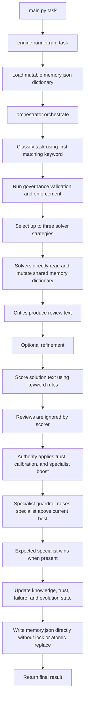
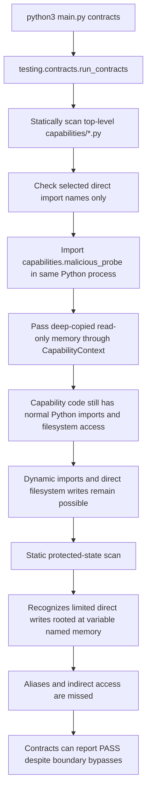
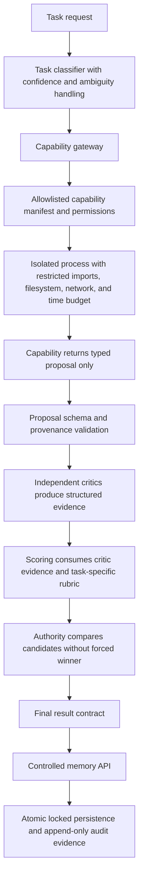

# CortexMesh: Current vs Intended Architecture

This document describes observed code behavior. It does not rely on comments or
planned architecture.

## Current Normal Task Flow

### Important Consequence

Capabilities are not invoked during normal task execution. There is no
capability gateway in the production task path.

## Current Capability Test Flow

## Intended Architecture

## Gap Matrix

| Area | Current behavior | Intended control | Required remediation |
|---|---|---|---|
| Capability routing | No production capability execution path | One explicit gateway for every capability | Create a capability registry and gateway; prohibit direct imports from task code |
| Capability isolation | Contract probe runs in the main process | Separate constrained process | Execute capabilities in a subprocess/container with explicit permissions |
| Filesystem access | Capability can read/write arbitrary accessible paths | Deny by default | Restrict working directory and expose only approved file APIs |
| Import control | AST scan blocks a short list of direct imports | Allowlist enforced at runtime | Enforce imports in isolated runtime; reject dynamic import bypasses |
| Memory access | Shared modules mutate dictionaries directly | Controlled typed memory API | Replace direct protected-state writes with validated commands |
| Persistence | Direct truncate-and-write of `memory.json` | Atomic, locked, recoverable writes | Lock, write temporary file, fsync, validate, then atomic replace |
| Contract scanning | Detects limited syntax rooted at `memory` | Semantic and runtime enforcement | Treat static scanning as defense-in-depth, not the security boundary |
| Critic influence | Review text is generated but ignored by scoring | Structured reviews affect scores | Define review schema and consume validated critic findings |
| Refinement | Triggered by generic critic text; old reviews score new outputs | Re-review refined output | Apply budget, preserve participant set, and critique refined solutions again |
| Authority routing | Specialist is raised above the best candidate | Specialist preference remains bounded | Remove forced override; report routing confidence separately |
| Task classification | First matching keyword wins | Ambiguity-aware routing | Score all task-type signals and expose classification confidence |
| Tamper retention | Truncation breaks hash chain after 500 records | Verifiable bounded retention | Store a signed/checkpointed anchor when pruning old events |
| Snapshot integrity | Individual snapshot hashes; deletion undetected | Chained/anchored snapshot history | Chain snapshots and persist an external or separately protected anchor |
| Governance overflow | Logged but overflowing strategies remain selectable | Violation blocks participation | Quarantine or deterministically retire overflow strategies |
| Benchmark scoring | Keyword matching rewards rubric vocabulary | Independent quality judgment | Use blinded human/model judging with calibrated examples and anti-gaming tests |
| Regression claims | Specialist tests mirror forced specialist rule | Tests challenge decision quality | Add adversarial candidates where a non-specialist should win |

## Remediation Acceptance Criteria

1. No capability can import protected internals, write arbitrary files, mutate
   persisted memory, or return a final result directly.
2. Every capability execution is isolated, permissioned, timed, logged, and
   returns a typed proposal.
3. Contracts fail when aliasing, dynamic imports, filesystem writes, or direct
   persistence attacks are attempted.
4. Authority can select a non-specialist when its evidence-backed score is
   materially better.
5. Critic reviews measurably affect scoring, and refined outputs are reviewed
   again.
6. Concurrent or interrupted persistence cannot corrupt the last valid memory
   state.
7. Tamper logs and snapshots remain verifiable through retention rollover and
   deletion attempts.
8. External benchmarks cannot be improved merely by appending rubric keywords
   or unanswered checklist questions.

## Current Lock Decision

The current implementation does not provide a proven capability sandbox or a
reliable governance boundary. Core and Governance locks should remain revoked
until the acceptance criteria above pass repeatable adversarial tests.
